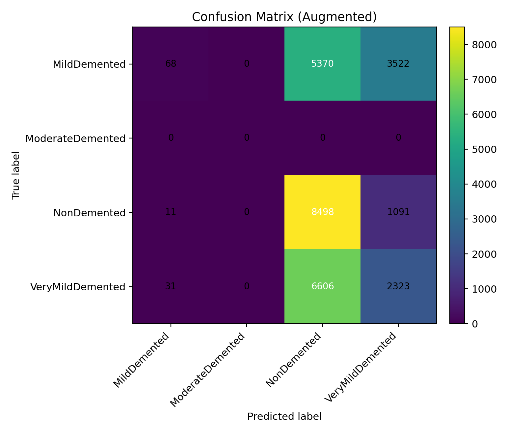

🧠 NeuroWell — Early Alzheimer’s Detection (MRI 2D Slices)

NeuroWell is a practical, end-to-end demo that trains a CNN on MRI slice images to classify four stages:

NonDemented

VeryMildDemented

MildDemented

ModerateDemented

It includes training, evaluation plots (accuracy/loss + confusion matrices), Grad-CAM explainability, and batch prediction on an augmented dataset.

⚠️ Research demo only — not for clinical use.

✨ What’s inside

Unicode-safe data loader (handles Windows paths like Alzheimer’s with the curly apostrophe)

Transfer learning with EfficientNetB0 (Keras / TensorFlow 2.15)

Artifacts: model (.keras + .h5), label encoder (.pkl), config (.yaml), metrics (.json)

Evaluation: accuracy/loss curves, confusion matrix heatmaps, classification report

Explainability: Grad-CAM heatmap + overlay

Batch prediction on Augmented dataset with CSV/JSON outputs

🗂️ Folder expectations
C:\Users\NXTWAVE\Downloads\Alzheimer’s Detection\
├─ archive\
│  ├─ OriginalDataset\
│  │  ├─ NonDemented\
│  │  ├─ VeryMildDemented\
│  │  ├─ MildDemented\
│  │  └─ ModerateDemented\
│  └─ AugmentedAlzheimerDataset\
│     ├─ NonDemented\
│     ├─ VeryMildDemented\
│     ├─ MildDemented\
│     └─ (optionally) ModerateDemented\
└─ (outputs land here)

If any class folder is missing or empty, the scripts will warn/fail accordingly.

🧰 Environment

OS: Windows 10 (64-bit)

Python: 3.11 (works with 3.10 as well)

TensorFlow: 2.15.1 (CPU by default)

Create/activate a venv (recommended)
python -m venv .venv
.\.venv\Scripts\activate
python -m pip install --upgrade pip setuptools wheel

Install dependencies
pip uninstall -y tensorflow tensorflow-intel tensorflow-cpu keras keras-nightly
pip install "numpy<2" h5py "protobuf<4.25"
pip install "tensorflow==2.15.1"
pip install opencv-python scikit-learn matplotlib pandas pyyaml

If you see ImportError: DLL load failed: install the Microsoft Visual C++ 2015–2022 Redistributable (x64) from Microsoft’s site, then restart the kernel.

🚀 Quickstart
1) Train & save artifacts

Script: neurowell_build_artifacts_paths.py
This script:

loads images from your OriginalDataset four folders,

trains EfficientNetB0,

saves model/artifacts and a metrics report,

generates accuracy/loss plots, confusion matrices, and Grad-CAM (if you used the “train+plots” version).

Run in Jupyter or Python:

# In a Jupyter cell or save as neurowell_build_artifacts_paths.py and run:
# python neurowell_build_artifacts_paths.py

Outputs (saved in C:\Users\NXTWAVE\Downloads\Alzheimer’s Detection\):

neurowell_best.keras
neurowell_model.h5
label_encoder.pkl
config.yaml
report.json
accuracy_curve.png
loss_curve.png
confusion_matrix.png
confusion_matrix_normalized.png
classification_report.txt
gradcam_heatmap.png
gradcam_overlay.png
training_log.csv

The dataset is imbalanced (e.g., few ModerateDemented). Consider longer training and/or class weighting for better results.

2) (Optional) Only make plots after training

If you trained earlier and just want accuracy/loss, confusion matrices, and Grad-CAM, use the plotting cell we provided (the one that auto-reloads model/labels and rebuilds val_ds if needed). It will create the same PNG/TXT outputs.

3) Batch prediction on the Augmented dataset

Script: neurowell_predict_augmented.py

This will:

load neurowell_best.keras (or fall back to neurowell_model.h5),

read four Augmented folders (deduplicates if the same folder is listed twice),

run batched inference,

write per-image predictions and overall metrics.

Run:

# In a Jupyter cell or:
# python neurowell_predict_augmented.py

Outputs:

augmented_predictions.csv
augmented_predictions.json
augmented_classification_report.txt
augmented_confusion_matrix.png
augmented_confusion_matrix_normalized.png

⚙️ Configuration knobs

Inside the training script:

CFG = {
  "seed": 42,
  "img_size": 224,
  "batch_size": 32,
  "epochs": 5,            # increase to 10–20 for better results
  "val_split": 0.2,
  "learning_rate": 1e-4,
  "label_smoothing": 0.0,
  "augment": True,
  "artifact_prefix": "neurowell",
}

Tips:

Raise epochs (10–20+) and optionally unfreeze part of EfficientNet for fine-tuning after a few warm-up epochs.

Add class weights if your labels are imbalanced.

Keep img_size=224 for EfficientNetB0, or switch to B1/B3 with larger inputs if you have compute.

🧪 Explainability (Grad-CAM)

The scripts generate:

gradcam_heatmap.png

gradcam_overlay.png

They’re produced from a validation sample (RGB overlay on the MRI slice). If you want Grad-CAM for a specific image, add a small utility:

def gradcam_for_path(model, path, out_dir, img_size=(224,224), layer_name="top_conv"):
    import cv2, numpy as np, tensorflow as tf, matplotlib.pyplot as plt
    from pathlib import Path
    out_dir = Path(out_dir); out_dir.mkdir(parents=True, exist_ok=True)
    # Unicode-safe read
    data = np.fromfile(path, dtype=np.uint8)
    bgr = cv2.imdecode(data, cv2.IMREAD_COLOR)
    rgb = cv2.cvtColor(bgr, cv2.COLOR_BGR2RGB)
    rgb = cv2.resize(rgb, img_size[::-1], interpolation=cv2.INTER_AREA).astype(np.float32)
    batch = np.expand_dims(rgb, 0)

    try:
        last_conv = model.get_layer(layer_name)
    except:
        last_conv = next(l for l in reversed(model.layers) if isinstance(l, tf.keras.layers.Conv2D))
    grad_model = tf.keras.models.Model([model.inputs], [last_conv.output, model.output])

    with tf.GradientTape() as tape:
        conv_out, preds = grad_model(batch)
        idx = tf.argmax(preds[0]); loss = preds[:, idx]
    grads = tape.gradient(loss, conv_out)
    pooled = tf.reduce_mean(grads, axis=(0,1,2))
    conv = conv_out[0]
    heatmap = tf.reduce_sum(conv * pooled, axis=-1)
    heatmap = tf.maximum(heatmap, 0) / (tf.reduce_max(heatmap) + 1e-8)
    heatmap = heatmap.numpy()
    hm = cv2.resize(heatmap, img_size[::-1])
    hm8 = np.uint8(255*hm)
    hm_color = cv2.applyColorMap(hm8, cv2.COLORMAP_JET)
    hm_color = cv2.cvtColor(hm_color, cv2.COLOR_BGR2RGB)
    overlay = cv2.addWeighted(rgb.astype(np.uint8), 0.6, hm_color, 0.4, 0)

    plt.imsave(out_dir/"gradcam_heatmap_custom.png", hm, cmap="jet")
    plt.imsave(out_dir/"gradcam_overlay_custom.png", overlay)

📦 Artifacts explained

neurowell_best.keras: Best checkpoint by validation accuracy (preferred for inference)

neurowell_model.h5: Final trained model in H5 format (also usable for inference)

label_encoder.pkl: Class order → index mapping

config.yaml: Paths, hyperparameters, artifacts

report.json: Class counts, validation metrics, sample predictions

🧯 Troubleshooting

1) TensorFlow import DLL error (Windows)
Install the Microsoft Visual C++ 2015–2022 Redistributable (x64), then restart the kernel/IDE.

2) NotFoundError: Could not find directory ... OriginalDataset
Verify the exact path exists and contains images (jpg/png/bmp/tiff). Watch out for typos and the curly apostrophe in Alzheimer’s.

3) UnknownError ... EagerTensor has no attribute 'decode'
Use path_tensor.numpy().decode("utf-8") inside tf.py_function (our scripts do this).

4) RepresenterError: cannot represent an object when writing YAML/JSON
Ensure you cast NumPy types to native Python (str, int, float) before dumping (our scripts sanitize types).

5) Imbalanced dataset (e.g., ModerateDemented tiny)
Use more epochs, class weights, or augmentation. Evaluate with the normalized confusion matrix to understand per-class behavior.

🧪 Example prediction row (CSV)
file_path,true_label,true_idx,pred_label,pred_idx,confidence
...VeryMildDemented\image_000123.jpg,VeryMildDemented,3,VeryMildDemented,3,0.8732

🔐 Ethics & Compliance

This project is for educational research only. It is not a medical device, and outputs must not be used for diagnosis or patient management.

🤝 Contributing

Open an issue with a clear description (environment, steps, logs).

PRs welcome for: class weighting, multi-slice/3D support, better Grad-CAM UX, mixed precision, dataset loaders for NIfTI/DICOM.
Author
SAGNIK PATRA
